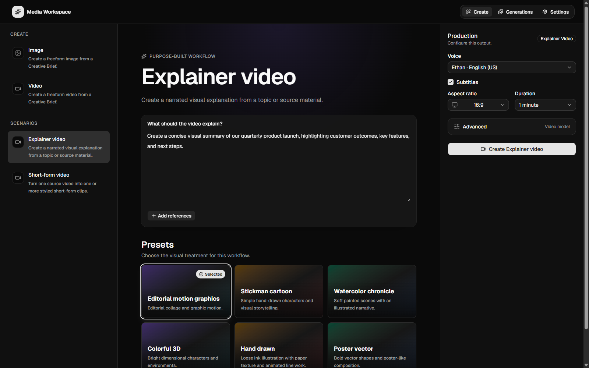

# Media Gen



Media Gen is a prototype exploring what a modern enterprise media studio could
look like when built on an organization's own Microsoft Foundry resources.
Inspired by video creation tools such as Higgsfield, it combines guided
creation workflows, model routing, local history, and agent-driven operation
without introducing a hosted control plane.

The broader idea is to help enterprise teams turn approved context and existing
assets into repeatable media workflows, including:

- meeting summary videos created from notes, transcripts, and presentation assets
- trip summary videos assembled from photos, clips, and itinerary context
- narrated or visual Explainers grounded in internal documentation
- product marketing images, launch videos, and short-form campaign variants

The working prototype currently provides:

- general image and video Generators using configured Foundry deployments
- narrated Explainer video and Short-form video Scenarios
- a coding-agent skill, the `mg` CLI, and a browser UI served locally
- private Generation history with Recreate, Edit, Resume, Reference, and Export

> [!NOTE]
> This is an early source-only exploration, not a finished enterprise service.
> Meeting and trip examples describe workflows the prototype is intended to
> explore; direct meeting, calendar, and travel-system integrations are not
> included. There is no published npm package, and interfaces may change.

## Requirements

- Node.js 22 or later
- Azure CLI (`az`)
- access to a Microsoft Foundry project with supported deployments
- Azure Speech only when narrated Explainer videos are required

## Install

```powershell
git clone https://github.com/therealjohn/media-generator.git
cd media-generator
npm ci
npm run build
npm link
mg --help
```

`npm link` makes the `mg` command available globally from this checkout.
Rebuild after pulling source changes.

## Agent-first quickstart

Start in the directory where you want to create media. Install the skill for
your coding agent before setting up the workspace:

```powershell
mg skills install --target github-copilot
```

Other targets are `claude`, `codex`, and `cursor`.

Then prompt the agent:

> Use the generate-media skill to initialize Media Gen in this directory,
> check my Azure CLI authentication, connect the Microsoft Foundry project at
> `https://<resource>.services.ai.azure.com/api/projects/<project>`, run
> diagnostics, create a minimal-studio image for a product launch, and export
> the result to `assets/generated`.

The installed skill tells the agent to inspect the live `mg skills` guidance,
use the CLI for every change, and ask before any operation that requires
`--force`.

See [Agent-first workflows](docs/agent-workflows.md) for more prompts and
supported agent targets.

## Manual CLI quickstart

Run these commands from the directory that should hold the project manifest
and exported assets:

```powershell
mg init
mg auth
mg auth login
mg configure foundry --name primary --endpoint "https://<resource>.services.ai.azure.com/api/projects/<project>"
mg doctor

mg create image --prompt "Create a clean product launch visual" --style minimal-studio
mg generations list
mg generations export <generation-id> --to .\assets\generated
```

Run `mg auth login` only when `mg auth` reports that Azure CLI is signed out.
Use `mg serve` to open the Local UI instead of creating media directly from the
terminal.

## Documentation

- [Getting started](docs/getting-started.md)
- [Agent-first workflows](docs/agent-workflows.md)
- [Creating and managing media](docs/creating-media.md)
- [CLI reference](docs/cli-reference.md)
- [Storage and privacy](docs/storage-and-privacy.md)

Every command also has scoped help, for example:

```powershell
mg create explainer-video --help
mg generations export --help
mg skills install --help
```

For contribution, support, and security guidance, see
[CONTRIBUTING.md](CONTRIBUTING.md), [SUPPORT.md](SUPPORT.md), and
[SECURITY.md](SECURITY.md).

## License

[MIT](LICENSE). Third-party material is listed in
[THIRD_PARTY_NOTICES.md](THIRD_PARTY_NOTICES.md).

## Key takeaway

The main takeaway from this prototype is that the application workflow was
feasible, but the available video model quality was not good enough to deliver
the target experience. Sora 2 was the only Foundry video model available to
test, and it did not produce sufficiently consistent, high-quality results for
the enterprise content this project explores, including summaries, Explainers,
and polished product marketing videos.

Alternatives such as Fable and Gemini Omni could not be evaluated because they
were not available in the Foundry environment used for this project. This is a
finding about the models and access available for this evaluation, not every
video model that Foundry may support. A production version would need access
to stronger models followed by a new quality evaluation.
