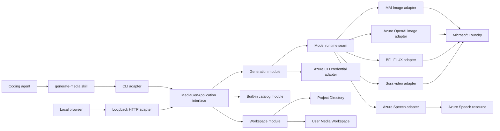

# Media Gen Architecture

## Constraints

- local-first; no hosted control plane
- TypeScript and Node.js 22 or later
- one npm package with the `mg` executable and bundled React UI
- `.mg/config.json` is shared configuration
- `~/.media-gen` is private working state
- the filesystem is the authoritative Generation store
- the CLI is the single execution engine
- Foundry is the initial Model Provider
- multiple Foundry projects and model API families must work together
- CLI output follows AXI principles

## System view



## Primary seam

The CLI and loopback HTTP server are adapters over one deep `MediaGenApplication` module.

Its external interface should be small:

```ts
interface MediaGenApplication {
  execute(command: MediaGenCommand, context: CommandContext): Promise<MediaGenResult>
}
```

`MediaGenCommand` is a versioned discriminated union for:

- home
- init
- auth
- configure
- create Generator or Scenario
- generate image/video compatibility aliases
- list/get/enable/disable Scenario
- list/get/delete/export Generation
- edit/recreate/reference Generation
- doctor
- skills

The interface includes:

- command invariants
- structured error and exit-code behavior
- required workspace state
- cancellation behavior
- progress reporting
- output-format rules

The implementation hides:

- manifest discovery and migration
- registry lookup
- file locking and atomic writes
- prompt assembly
- model capability resolution
- provider authentication
- sync and async provider behavior
- output download and normalization
- Generation state transitions

Tests and callers use this same interface.

## Internal modules

### Workspace module

Responsibilities:

- find the nearest `.mg/config.json`
- validate and migrate the Workspace Manifest
- initialize exactly in the selected current directory
- maintain `~/.media-gen/registry.json`
- resolve the associated Media Workspace
- read and write `local.json`
- provide atomic filesystem operations and scoped locks
- report disk usage

This is a deep module. Callers do not know registry or directory-layout details.

### Built-in catalog module

Responsibilities:

- own Generator, Scenario, Preset, and Style definitions
- own Scenario Production Option schemas
- own model capability declarations
- validate Generator and Scenario choices
- determine Eligible Models
- resolve `Auto` to the configured default deployment
- assemble the transient Model Prompt
- expose a versioned catalog identifier

The Model Prompt never crosses this module's interface as persisted data.

### Creation module

Responsibilities:

- expose one `create` interface for Generator and Scenario requests
- assemble Generator or Scenario prompts
- translate Presets and Production Options into typed controls
- resolve the Scenario's execution roles
- prepare Selection, Scenario, resource, operation, and progress metadata
- delegate normalized execution to the Generation module

The application resolves workspace routing and provider configuration before
calling this module. CLI and HTTP adapters do not implement Scenario logic.

### Generation module

Responsibilities:

- validate a Generation request
- fingerprint Reference Assets
- validate Web Reference URLs without fetching them
- save pasted Text References under the Generation's private `inputs/`
- create and lock the Generation directory
- resolve the Model Deployment
- call the model runtime seam
- poll asynchronous providers
- normalize and save output files
- update status atomically
- support Edit, Recreate, Reference, Export, and Delete
- link derived Generations to their sources

### Model runtime seam

Model Providers are true external dependencies. Define one internal interface and multiple adapters:

```ts
interface ModelAdapter {
  capabilities(deployment: ModelDeployment): ModelCapabilities
  generate(request: ProviderGenerationRequest): Promise<ProviderGenerationResult>
}
```

The interface must hide:

- endpoint construction
- authentication scope
- request encoding
- multipart handling
- polling
- provider response shapes
- temporary URL downloads
- provider-specific errors

Production adapters:

| Adapter | Models | Behavior |
| --- | --- | --- |
| `MAIImageAdapter` | MAI Image 2.5, Flash, 2e | synchronous base64 image generation and supported edits |
| `AzureOpenAIImageAdapter` | GPT Image 2 | synchronous generation and edits |
| `BFLFluxAdapter` | FLUX.1 and FLUX.2 family | synchronous native BFL provider calls |
| `MAIVoiceAdapter` | MAI-Voice-2 family | synchronous Azure Speech SSML synthesis to MP3 |
| `SoraVideoJobAdapter` | Sora 2 | submit, poll, and download MP4 |

Testing uses a fake adapter at the same seam.

### Authentication module

Foundry authentication uses the Azure CLI context:

- `mg auth` reports `az` availability, signed-in identity, tenant, and subscription.
- `mg auth login` invokes or guides `az login`.
- `mg auth logout` invokes `az logout`.
- runtime token acquisition uses `AzureCliCredential`.
- tokens remain in memory and are never written to Media Gen configuration.

The Foundry project endpoint is enough to construct `AIProjectClient` and enumerate deployments through its `.deployments` operations.

Azure Speech uses a separate private Speech Connection. The adapter sends the
machine-local API key as `Ocp-Apim-Subscription-Key`; it does not use the Azure
CLI credential or Foundry deployment discovery.

Sources:

- [Microsoft Foundry SDK endpoints](https://learn.microsoft.com/en-us/azure/foundry/how-to/develop/sdk-overview)
- [Azure AI Projects JavaScript SDK](https://learn.microsoft.com/en-us/javascript/api/overview/azure/ai-projects-readme?view=azure-node-latest)

### Skills module

Responsibilities:

- render the current action/reference catalog
- install the lightweight `generate-media` skill
- keep installed skill content short
- make CLI guidance the versioned source of truth

Initial catalog:

```text
mg skills
|- initialize
|- configure
|  |- foundry
|  |- models
|- generate
|  |- image
|  |- video
|- inspect
|  |- generations
|- export
|- troubleshoot
```

## Dependency strategy

| Dependency | Category | Strategy |
| --- | --- | --- |
| Prompt and catalog computation | In-process | Test directly through `MediaGenApplication`. |
| Filesystem | Local-substitutable | Use temporary directories in tests. Do not expose a filesystem port through the external interface. |
| Microsoft Foundry | True external | Inject model adapters; tests use fakes. |
| Azure CLI | True external process | Inject a credential/process adapter; tests use a fake. |
| Clock and ID generation | In-process internal seam | Inject deterministic implementations in tests. |

## Project configuration

Tracked file:

```text
<project>/.mg/config.json
```

Illustrative shape:

```json
{
  "schemaVersion": 2,
  "workspace": {
    "name": "media-generator"
  },
  "scenarios": {
    "enabled": []
  },
  "providers": {
    "foundry-east": {
      "kind": "microsoft-foundry",
      "projectEndpoint": "https://example.services.ai.azure.com/api/projects/media-east"
    },
    "foundry-west": {
      "kind": "microsoft-foundry",
      "projectEndpoint": "https://example.services.ai.azure.com/api/projects/media-west"
    }
  },
  "deployments": {
    "mai-image-2.5-flash": {
      "provider": "foundry-east",
      "deploymentName": "mai-image-fast",
      "model": "MAI-Image-2.5-Flash",
      "adapter": "mai-image"
    },
    "sora-2": {
      "provider": "foundry-west",
      "deploymentName": "sora-video",
      "model": "sora-2",
      "adapter": "sora-video"
    }
  },
  "routing": {
    "generators": {
      "image": {
        "auto": [
          "mai-image-2.5-flash"
        ]
      },
      "video": {
        "auto": [
          "sora-2"
        ]
      }
    },
    "scenarios": {
      "explainer-video": {
        "visuals": {
          "auto": [
            "sora-2"
          ]
        }
      },
      "short-form-video": {
        "video": {
          "auto": [
            "sora-2"
          ]
        }
      }
    }
  },
  "export": {
    "defaultDirectory": "assets/generated"
  }
}
```

The manifest contains no tokens or API keys.

Both CLI and Local UI edit it through the Workspace module.

## User-home layout

```text
~/.media-gen/
|- registry.json
`- workspaces/
   `- <project-slug>--<workspace-id>/
      |- local.json
      |- generations/
      |  `- <generation-id>/
      |     |- generation.json
      |     `- outputs/
      |- cache/
      `- logs/
```

`registry.json` maps canonical Project Directory paths to generated local workspace IDs. Moving a Project Directory requires an explicit relink operation.

`local.json` holds private credentials and machine-specific overrides. Azure
Speech configuration is stored there:

```json
{
  "schemaVersion": 1,
  "speech": {
    "endpoint": "https://example.cognitiveservices.azure.com/",
    "apiKey": "<private>",
    "defaultVoice": "en-US-Ethan:MAI-Voice-2"
  }
}
```

The Speech API key is never copied into `.mg/config.json`, Generation records,
structured CLI output, or Settings responses. Normal Foundry configuration
remains in `.mg/config.json`.

## Generation record

Each Generation has a stable sortable ID, such as a UUIDv7.

Illustrative record:

```json
{
  "schemaVersion": 4,
  "id": "0198...",
  "status": "succeeded",
  "createdAt": "2026-08-17T20:00:00Z",
  "updatedAt": "2026-08-17T20:01:18Z",
  "creativeBrief": "Choose the strongest product insight.",
  "selection": {
    "kind": "scenario",
    "scenario": "short-form-video",
    "preset": "bold-urban"
  },
  "scenario": {
    "inputs": {
      "sourcePaths": [
        "C:\\assets\\interview.mp4"
      ]
    },
    "options": {
      "orientation": "vertical",
      "subtitles": true,
      "clip-count": 3,
      "clip-duration": 8,
      "language": "auto"
    }
  },
  "references": [
    {
      "path": "C:\\assets\\interview.mp4",
      "mediaType": "video/mp4",
      "size": 124315,
      "modifiedAt": "2026-08-16T18:00:00Z",
      "sha256": "..."
    }
  ],
  "textReferences": [
    {
      "title": "Product documentation",
      "format": "markdown",
      "path": "inputs/text-reference-1.md",
      "size": 1240,
      "sha256": "..."
    }
  ],
  "webReferences": [
    {
      "url": "https://docs.example.com/product"
    }
  ],
  "resolvedModel": {
    "model": "sora-2",
    "deployment": "sora-video",
    "provider": "foundry-west"
  },
  "resolvedResources": [
    {
      "role": "video",
      "id": "sora-2",
      "model": "sora-2",
      "deployment": "sora-video",
      "provider": "foundry-west"
    }
  ],
  "operations": [
    {
      "kind": "scenario-prepare",
      "status": "succeeded"
    },
    {
      "kind": "model-generate",
      "status": "succeeded"
    }
  ],
  "progress": {
    "stage": "succeeded",
    "completed": 2,
    "total": 2
  },
  "sourceGenerations": [],
  "runtime": {
    "cliVersion": "0.1.1",
    "catalogVersion": "3"
  },
  "provider": {
    "jobId": null
  },
  "outputs": [
    {
      "path": "outputs/output-1.png",
      "mediaType": "image/png",
      "size": 1824315,
      "sha256": "..."
    }
  ],
  "error": null
}
```

The internal Model Prompt and raw provider request are not stored.

Generation record version 1 used fixed product-marketing `scenario` and
`deliverable` fields. Version 2 introduced Generator and Scenario
Selections. Version 3 added Scenario inputs and options, resolved resources,
operations, and progress. Readers normalize versions 1-3 into version 4,
which adds Text Reference metadata and Web Reference URLs. Text content is
stored in private Generation input files rather than inline in the record.

## Generation lifecycle

```text
created -> validating -> submitted -> running -> succeeded
                                      `-> failed
```

An interrupted process can leave `submitted` or `running` state. The prototype reports that state but does not implement resume.

Record writes are atomic. The directory identity, inputs, and terminal outputs are immutable after completion. Edit and Recreate create new directories.

## Concurrency

Multiple Generations can run concurrently.

- each Generation has a per-record lock
- status writes use write-to-temp plus atomic rename
- registry and manifest writes use short scoped locks
- one Generation never holds a global lock while waiting on a provider
- Local UI reloads filesystem-backed state through the HTTP adapter when a
  view loads or the user refreshes it

## Reference Assets

Reference files remain at their original paths.

At submission, Media Gen records:

- absolute path
- byte size
- modified time
- media metadata
- SHA-256

The UI reports each reference as present, missing, or changed.

## Prompt pipeline

```text
Creative Brief
  + Generator guidance and Style
    or Scenario guidance, Preset, and Production Options
  + local asset context
  + pasted Text Reference content
  + Web Reference URLs as provenance
  + adapter guidance
  -> transient Model Prompt
  -> Model Adapter
```

The Creative Brief, choices, Reference Source metadata, and private Text
Reference input files are persisted. The assembled Model Prompt is not.

Media Gen does not fetch Web References. The Agent Skill tells an agent to
read linked pages with its own tools and incorporate relevant content into
the Creative Brief; this avoids embedding a web crawler and its network
security policy into the product.

The operation and resource structures are intentionally plural. Explainer
video always runs Sora and stores an MP4. When Voice is selected, it also runs
MAI-Voice-2 independently and stores an MP3. Deterministic transcription,
local media muxing, and multi-scene composition can be added behind the
Creation module without widening `MediaGenApplication`.

## CLI contract

Top-level commands:

```text
mg
mg init
mg auth
mg configure
mg generate
mg generations
mg serve
mg doctor
mg skills
```

AXI behavior:

- no arguments show live workspace state, not generic help
- TOON is the default structured output
- `--output json` is supported
- lists expose minimal fields and total counts
- large fields are truncated with `--full` guidance
- empty states are explicit
- structured errors use stdout and nonzero exit codes
- progress and debug text use stderr
- output ends with concrete next-step commands
- every `--help` route shows command-scoped usage, options, examples, and next steps
- unknown commands and flags fail loudly

All commands are non-interactive except explicit `mg auth login` and `mg auth logout`.

Permanent deletion, export overwrite, and fallback-model retry require `--force`. Without it, the CLI exits 2 with a structured refusal.

## Local server

`mg serve`:

- resolves the nearest `.mg/config.json`
- opens the associated Media Workspace
- starts the bundled UI on `127.0.0.1` only
- exposes a small command-oriented HTTP adapter over `MediaGenApplication`
- serves static UI assets from the npm package
- runs in the foreground until stopped

The prototype has no LAN mode and no product authentication.

## Privacy and safety

- no Media Gen product telemetry
- no hosted history
- no internal Model Prompt persistence
- only explicit provider requests leave the machine
- diagnostics stay under `~/.media-gen`
- provider-native safety behavior is used
- policy errors are surfaced directly
- uniform Azure AI Content Safety is deferred

## Key invariants

1. Working media is never written into the Project Directory.
2. Export is the only operation that copies generated media into the Project Directory.
3. The CLI is the only writer of Generation state.
4. The Local UI and Agent Skill never call providers directly.
5. A completed Generation is never edited in place.
6. Fallback never runs without explicit approval.
7. Secrets never enter `.mg/config.json`.
8. Internal Model Prompts are never persisted.
